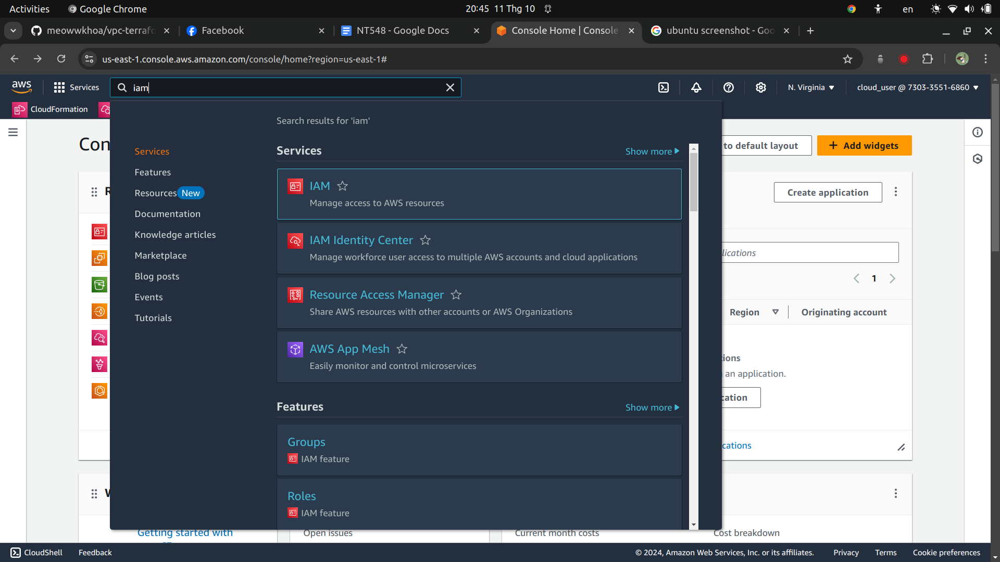
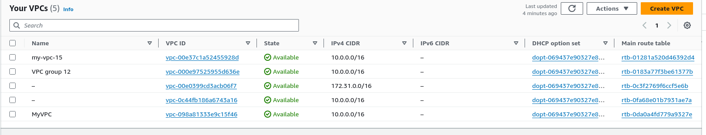
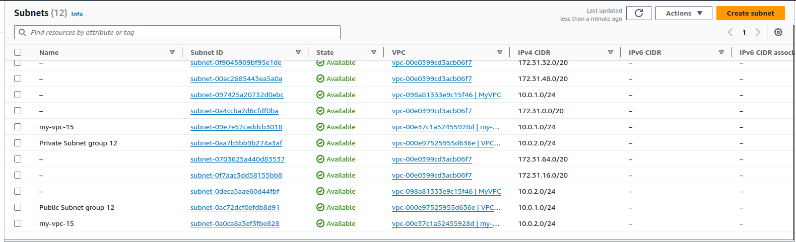
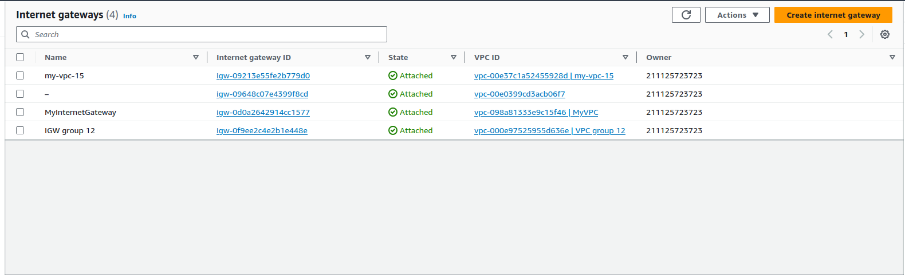
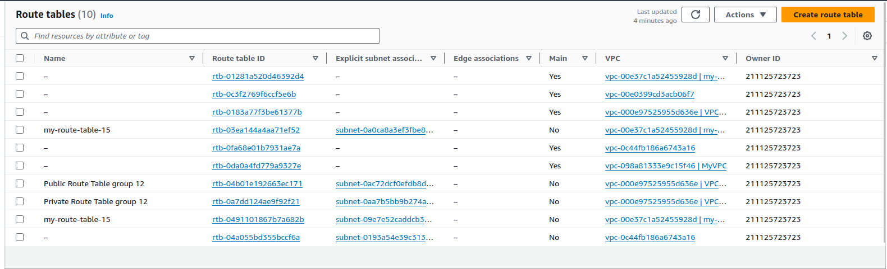
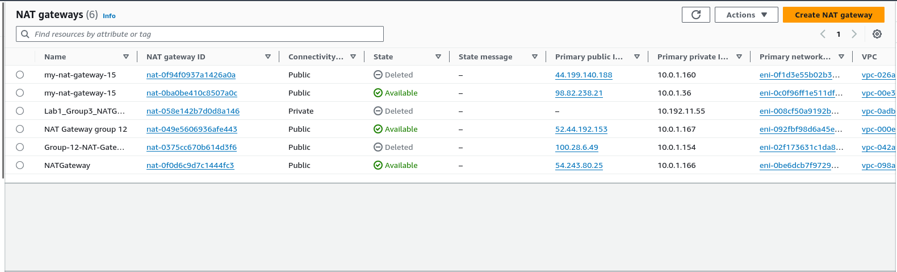
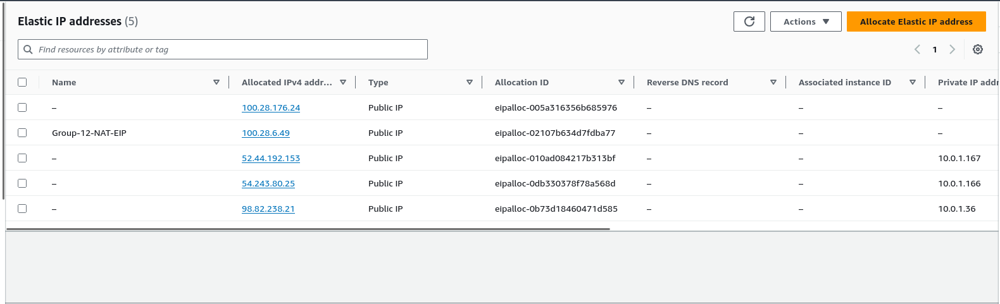
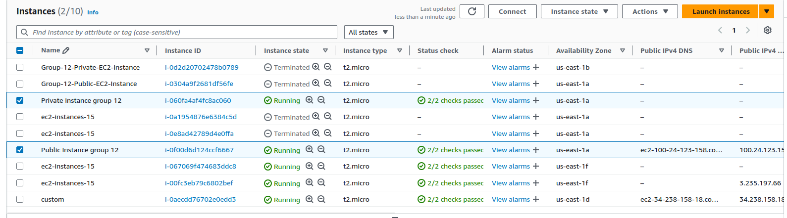
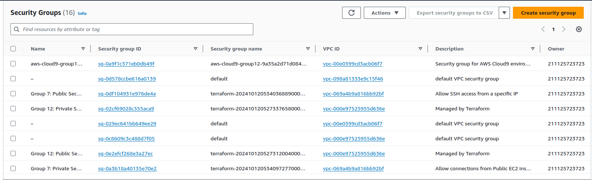

# README.md

<!-- @import "[TOC]" {cmd="toc" depthFrom=1 depthTo=6 orderedList=false} -->
<!-- code_chunk_output -->

* Contents:
    * Introduction
    * [Repository Structure](#repository-structure)
    * [Setup Instructions](#setup-instructions)
    * Usage
<!-- /code_chunk_output -->


## Introduction:
Creating a VPC using Terraform as IAAC and GitHub Actions as CI/CD for the NT548.P11 course - Fall 2024 semester at University of Information Technology - VNUHCM.


## Repository structure:
```txt
vpc-terraform-github-actions
  ├── .github
  │   └── workflows
  │       └── terraform-deploy.yml                /* GitHub Actions workflow file */
  ├── modules
  │   ├── VPC
  │   │   ├── main.tf
  │   │   ├── outputs.tf
  │   │   └── variables.tf
  │   ├── NAT
  │   │   ├── main.tf
  │   │   ├── outputs.tf
  │   │   └── variables.tf
  │   ├── Route_Table
  │   │   ├── main.tf
  │   │   ├── outputs.tf
  │   │   └── variables.tf
  │   ├── Security_Groups
  │   │   ├── main.tf
  │   │   ├── outputs.tf
  │   │   └── variables.tf
  │   └── EC2
  │       ├── main.tf
  │       ├── outputs.tf
  │       └── variables.tf
  ├── main.tf
  ├── outputs.tf
  ├── variables.tf
  ├── assets                                      /* Images */
  └── README.md                                   /* Readme file with instructions */


```

## Setup Instructions:
1. **Create AWS IAM User:**
   - Go to the IAM section in AWS.
   
   - Go to ``Users`` section.
   
   - Create a new user with your user name.
   
   - Attach the necessary policies.
   
   - Now we can see our user on the AWS platform.
   
   - Click on our user, then ``Security credentials``.
   
   - Go to ``Access keys`` and click ``Create access key``.
   
   - Choose ``CLI``.
   
   - Then ``Create access key``.
   
   - Now, we can either download the CSV file to save the keys or copy them directly.
   

2. **Configure GitHub Secrets:**
   - Go to the repository settings on GitHub.
   
   - Navigate to the "Environments" section.
   
   - Add the following secrets:
     - `AWS_ACCESS_KEY_ID`
     - `AWS_SECRET_ACCESS_KEY`
     - `AWS_REGION` (e.g., `us-east-1`)

      

## Usage:
1. **Clone the Repository:**
   ```bash
   git clone https://github.com/meowwkhoa/vpc-terraform-github-actions.git
   cd vpc-terraform-github-actions
   ```

2. **Create a New Branch:**
   ```bash
   git checkout -b test
   ```

3. **Make Changes and Push:**
- Make any necessary changes to the code.
- Stage and commit the changes:
   ```bash
   git add .
   git commit -m "test"
   git push origin test
   ```    

4. **Create a Pull Request:**
- Go to the repository on GitHub.
- Create a pull request from the `test` branch to the `main` branch.

5. **Monitor Deployment:**
   - The GitHub Action will trigger automatically.
   - Monitor the infrastructure changes in the AWS Management Console.
   
   - Our infrastructure ``VPC group 12``.
   

   - Subnet ``VPC group 12``.
   

   - Internet Gateway ``IGW group 12``.
   

   - Public Routable ``Public Routable group 12`` and Private Routable ``Private Routable group 12``.
   

   - NAT Gateway ``Group-12-NAT-Gateway``.
   

   - Elastic IP `Group-12-NAT-EIP`.
   

   - Public Instance `Public Instance group 12` and Private Instance `Public Instance group 12`.
   

   - Public Security Group `Group 12: Public Security Group` and Private Security Group `Group 12: Private Security Group`.
   